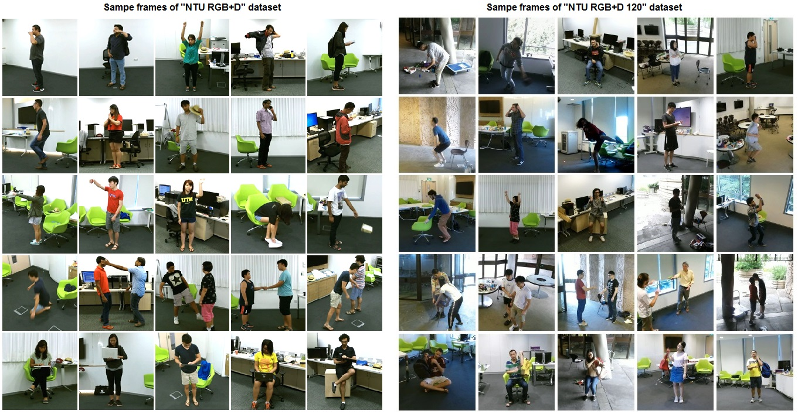
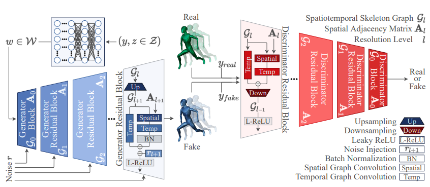
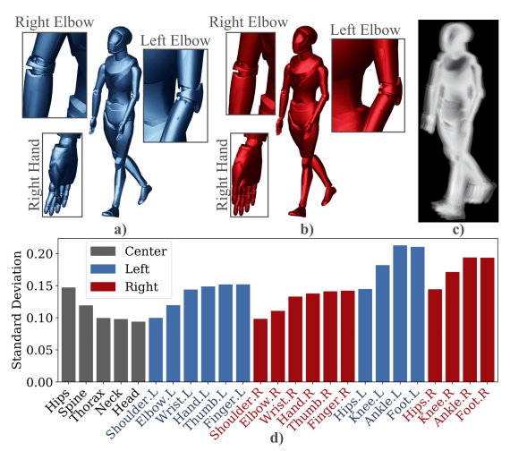

# Approve-Kinetic-GAN

[소프트웨어융합캡스톤 디자인]

<h3> 1. Overview </h3>
최근 딥러닝이 대두되는 가운데 사람의 행동 인식 및 행동 생성 또한 딥러닝을 통한 연구가 진행되고  있다. 특히 행동 인식보다는 행동 생성 분야에 대해서 어려운 과제들이 부여되고 있는데, ‘익숙한 자연 풍경’을 만드는 것은 쉽지만 ‘익숙한 사람의 얼굴’을 만드는 것은 어렵다. 자연 풍경보다 사람의 얼굴을 우리가 더 자주 보며, 얼굴로 사람을 인식하기 때문이다. 비슷하게, ‘익숙한 사람의 행동’을 만드는 것도 어려운 과제다. 하지만 해당 분야의 연구가 좀 더 진행된다면 영화나 그래픽 분야에서 CG 등을 통해 조연이나 캐릭터들이 더 자연스러운 행동을 취할 수 있도록 만들 수 있고, 다양한 곳에서도 활용할 수 있을 것이다.

<h3> 2. Dataset </h3>
- NTU RGB + D

- 60 action classes
- Benchmark
1) Cross-Subject
2) Corss-View

dataset 출처 : https://rose1.ntu.edu.sg/dataset/actionRecognition/

데이터의 크기가 GitHub에 업로드하기에는 너무 큰 관계로, 데이터를 다운받을 수 있는 링크는 아래와 같다.

다운로드 링크 : http://socia-lab.di.ubi.pt/~bruno/kinetic-gan/datasets/NTU/ntu.zip

<h3> 3. Model </h3>
Kinetic-GAN 코드 : https://github.com/DegardinBruno/Kinetic-GAN
위 링크에서 제공하는 Kinetic-GAN의 일부 코드를 수정하여 사용하였으며, cross-subject에 관해서는 kinetic-gan-mlp4의 Config를 적용한 모델을, cross-view에서는 kinetic-gan-mlp6의 Config를 적용한 모델을 사용하였다.

<h4> 성능 향상을 위한 시도 </h4>
Kinetic-GAN의 성능 향상을 위해 여러 가지 시도를 했으며, 이러한 시도를 소개한다.

<h5> 1) Discriminator의 Global Pooling 변경 </h5>
Kinetic-GAN에서는 Global Pooling을 진행할 때, average pooling을 사용한다. 이러한 방식은 모델의 안정성을 높이지만 수렴 속도를 느리게 한다는 단점이 있다. 또한 높은 수준의 특징은 더 큰 활성화 값을 가지는 CNN의 Inductive Bias에 의거하여, 기존의 Global average pooling을 max pooling으로 변경한 후 실험을 진행하였다. max pooling으로 진행할 경우, 더 높은 수준의 특징을 더 잘 잡아낼 것이라고 기대하였다.

<h5> 2) Discriminator의 Input에 Gaussian Noise 추가 </h5>
DCGAN에서 안정성을 높이기 위해 제안되는 방법 중 방법 중, Discriminator의 input에 noise를 넣는 방식을 시도해보았다. 코드를 수정하여 Discriminator가 downsampling을 진행할 때, 동일한 가우시안 노이즈를 주입하는 방식으로 실험을 진행했다.

<h5> 3) Discriminator의 label smoothing </h5>
2)에서 언급한 DCGAN의 안정성을 높이는 방법 중 또다른 하나는 label smoothing을 진행하는 것이다. 이는 Discriminator의 label에 noise를 넣어 label smoothing을 진행하는 것이다. 해당 GAN 모델에서는 Label이 HardCoding 방식이 아닌 Embedding 방식을 사용하기에, Embedding에 노이즈를 추가하여 실험을 진행하였다.

<h5> 4) Stochastic Variation의 응용 </h5>

위 사진은 기존 Kinetic-GAN의 논문에서 제시한 Stochastic Variation을 진행했을 때의 결과이다. joint마다 noise를 주입했을 때, 손가락이나 역동적인 동작이 이루어지는 곳에서 표준편차가 크게 나타난 것을 확인할 수 있다. 이를 통해 노이즈를 주입했을 때 다른 곳에 비해 더 많은 변화가 일어난 곳을 확인하여, 해당 부분에 Quntile Masking을 통해 노이즈를 추가로 주입하여 Data Augmentation의 효과를 유도할 수 있을 것이라고 기대하였다.

<h3> 4. Result </h3>
먼저 epoch의 수를 20으로 줄이고, epoch의 수를 감소시켰을 때 생성된 모델의 FID와 MMD 값을 측정하여 해당 값을 기준(baseline)으로 삼았다. 실험은 NTU RGB+D 데이터의 xsub, xview 벤치마크에 모두 적용하였다. 

- Cross-Subject

|Method|FID|MMDa|MMDs|
|------|---|---|---|
|Baseline|345.069|1.224|1.038|
|(A) Discriminator global max pooling|**315.459**|**1.193**|**1.029**|
|(B) + Discriminator input noise|369.010|**1.109**|**0.985**|
|(C) + Discriminator label smoothing|423.534|1.276|1.117|
|(D) No Discriminator noise + Generator Quantile Masking|350.439|**1.171**|**0.0996**|

- Cross-View

|Method|FID|MMDa|MMDs|
|------|---|---|---|
|Baseline|81.999|0.851|0.918|
|(A) Discriminator global max pooling|**65.664**|**0.828**|**0.900**|
|(B) + Discriminator input noise|**53.829**|0.870|0.937|
|(C) + Discriminator label smoothing|278.753|1.181|1.162|
|(D) No Discriminator noise + Generator Quantile Masking|388.057|1.084|0.920|

<h3> 5. Conclusion </h3>
GAN에서 성능 향상 및 안정성 기여를 위해 사용하는 기법들 중 몇 가지를 Kinetic-GAN에 적용해봤다. 그 중 몇가지는 실제로 성능 향상을 이루었으며, 몇 가지는 일부분 향상, 몇 가지는 아예 성능 하락이 이루어진 것을 확인할 수 있었다. 이러한 점은 epoch의 횟수를 늘리거나, 혹은 다른 방법으로의 접근이 필요해보인다.

<h3> Reference </h3>
[1] Bruno Degardin, Generative Adversarial Graph Convolutional Networks for Human Action Synthesis, arXiv preprint arXiv:2110.11191, 2021
[2] Martin Heusel, Hubert Ramsauer, Thomas Unterthiner, Bernhard Nessler, and Sepp Horchreiter, Gans trained by a two time-scale update rule converge to a local nash equilibrium, arXiv preprint arXiv:1706.08500, 2017.
[3] Alec Radford, Luke Metz, and Soumith Chintala, Unsupervised Representation Learning with Deep Convolutional Generative Adversial Networks, arXiv preprint arXiv:1511.06434, 201
